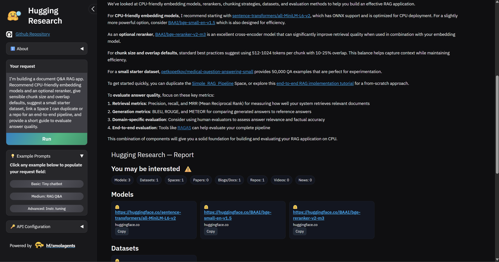

<p align="center">
  
</p>
<h1 align="center">Hugging Research</h1>

Hugging Research is a lightweight CodeAgent‑based research assistant for the Hugging Face Hub (models, datasets, Spaces, users, collections, papers). It gathers links via dedicated tools and organizes them for easy review.



## What it does
- Finds relevant models/datasets/Spaces/papers on the Hub
- Uses domain‑restricted search for tutorials and docs
- Avoids hallucinated links (only cites tool‑returned URLs)
- Organizes the found links into a simple, categorized view in the Report view

## Quick start
1) Clone and install
```bash
git clone https://github.com/mcdaqc/hugging-research
cd hugging-research
python -m venv venv
venv\Scripts\activate  # Windows
pip install -r requirements.txt
```

2) Configure your environment
```bash
cp .env.template .env
# Edit .env and set:
# HF_TOKEN=hf_xxx                # only for the inference model
# MODEL_ID=Qwen/Qwen3-Coder-480B-A35B-Instruct  # optional
```

3) Run the app
```bash
python app.py
# open http://localhost:7860
```

4) Use the app
- Enter your Hugging Face API key in the sidebar
- Click a Basic/Medium/Advanced example, or type your query in natural language
- Review the organized links in the Report view

## Configuration
- `HF_TOKEN`: used for the inference model (agent). Tools are anonymous/read‑only.
- `MODEL_ID`: default `Qwen/Qwen3-Coder-480B-A35B-Instruct`.


